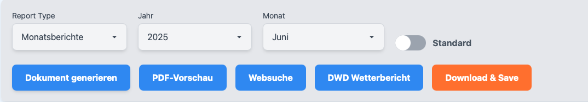
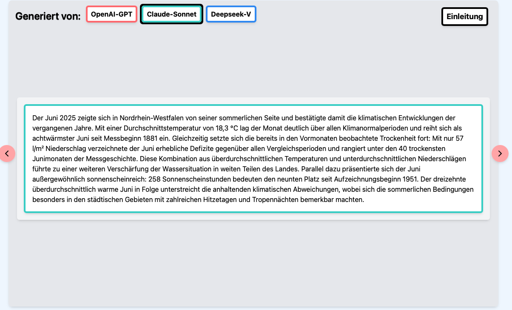
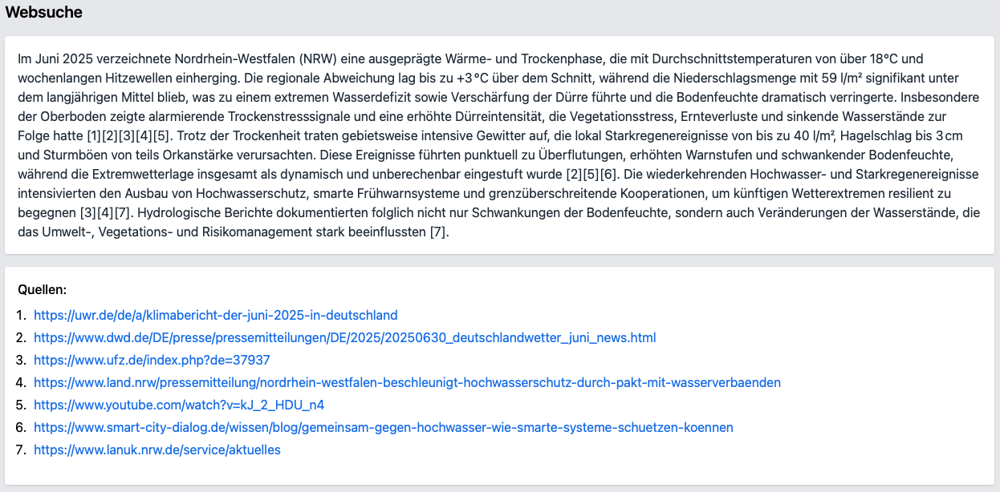
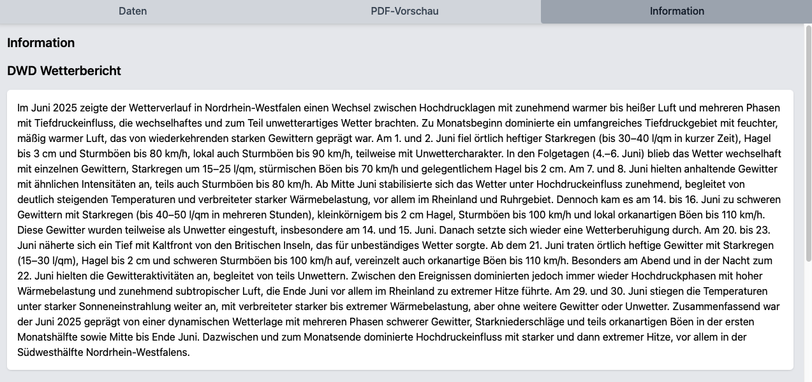
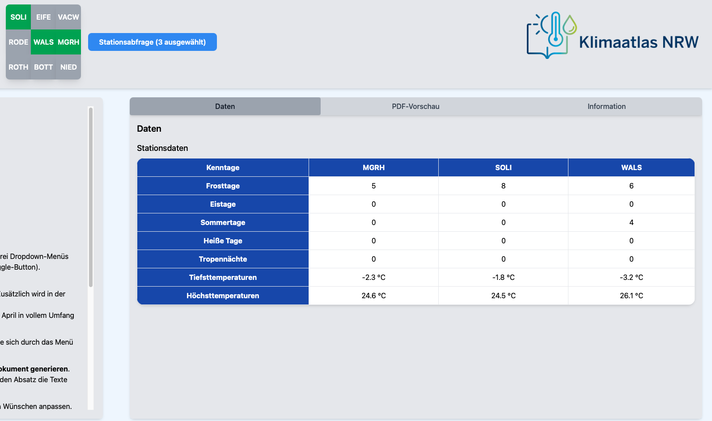
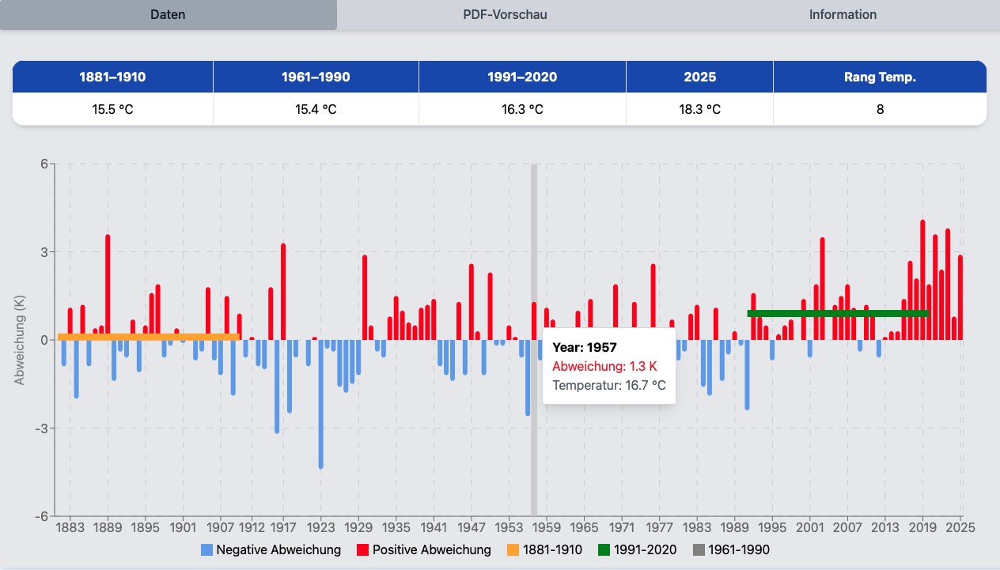
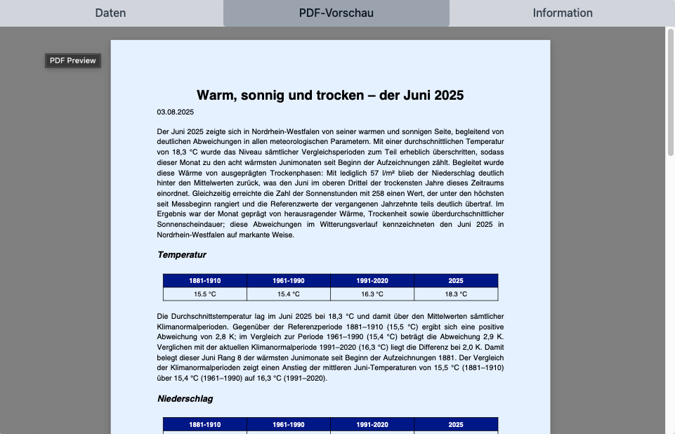
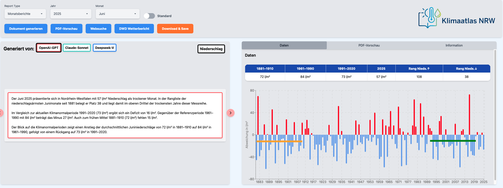

# Lanuk-Frontend

Das **Lanuk-Frontend** bildet über über App.tsx file das Frontend. Die gesamte Funktionalität ist modular im `src/`-Verzeichnis strukturiert. Die Anwendung wurde so entwickelt, dass sie als Asisstenzsystem den Anwender beim Verfassen der Berichte unterstützt.

---
## 📁 Filestruktur (`src/`)

| Ordner                | Beschreibung |
|-----------------------|--------------|
| `App.tsx`             | Zentrale Schnittstellenverwaltung und Main file für Frontend |
| `BaseModels.tsx`      | Interface |
| `ButtonGrid.tsx`      | Buttongrid 3x3 für Stationsauwahl |
| `Navbar.tsx`          | Navigationsleiste der Anwendung |
| `Informationsdisplay.tsx`      | Informationsmodul rechte Seite |
| `utils.tsx`           | Hilfsfunktionen |
| `Variationdisplay.tsx`| Variationsdisplay linke Seite |

--- 

## 💻 Benutzeroberfläche
- **Navigationsbar**: Berichtstyp, Jahr, Modus, Tools
- **Variationsdisplay**: Modell-Vergleich, Abschnitts-Editor  
- **Informationsdisplay**: Daten-Tab, PDF-Vorschau, Info-Tab  

---

## 📰 Frontend-Überblick

<table>
<tr>
<td width="50%">
<h4>📋 Navigationsbar</h4>

</td>
<td width="50%">
<h4>🖼️ Variationsdisplay</h4>

</td>
</tr>

<tr>
<td width="50%">
<h4>🔍 Websuche</h4>

</td>
<td width="50%">
<h4>🌦️ DWD-Wetterbericht</h4>

</td>
</tr>

<tr>
<td>
<h4>📰 Überschriftengenerator</h4>

</td>
<td>
<h4>📍 Stationsabfrage</h4>

</td>
</tr>

<tr>
<td>
<h4>📊 Zeitreihen-Vorschau</h4>

</td>
<td>
<h4>📄 PDF-Vorschau</h4>

</td>
</tr>

<tr>
<td colspan="2">
<h4>🖥️ Anwendung</h4>

</td>
</tr>
</table>

---